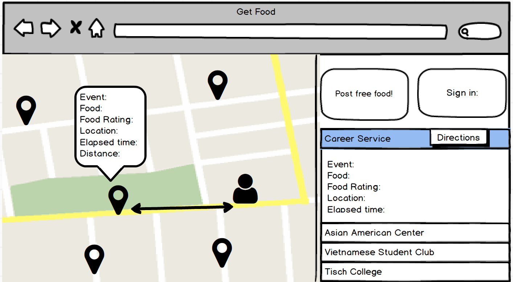
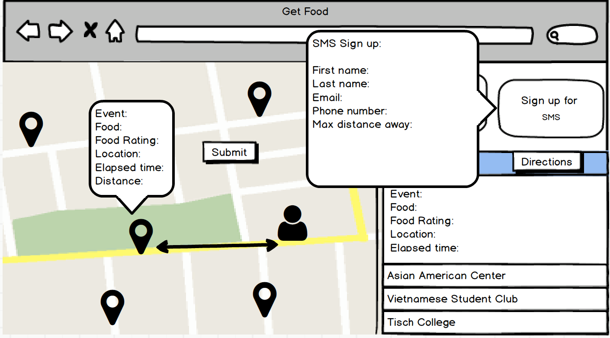
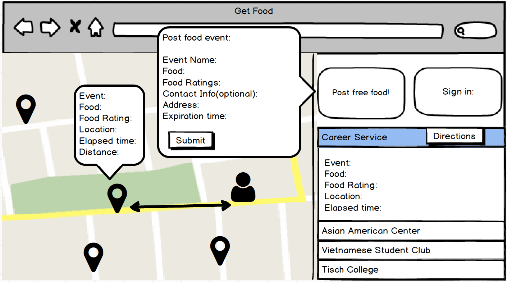

Joaquin Bustamante, Thu Cao, Binh Nguyen, Yekwon Park

Link:
https://feedme-co.herokuapp.com/

Title:
Feed Me

Problem:
Many people often have excess food that they usually throw away. This causes a huge problem with food waste and money waste..

Solution:
We will create a webpage where students or staff of Tufts University can post a list of excess food that they have. Others who access the webpage will be able to see all the food listings and be able to contact the user that listed it. They will also get a notification of new food listings within X miles if they register for SMS notifications. By doing this project, food waste can decrease and hungry students may be able to get the nutrients that they need.

Main Objectives:
-	Allow users to post food listings, including images and contact information
-	Allow users to view all food listings
-	Allow users to see the walking distance from current location to destination and estimate of how long it would took
-	Send notification to users if posting is within X miles of their preferred location

Features:
-	Geolocation
-	Server-side data persistence
-	Store listings, and locations. It should update itself to expire posts.
-	Send emails, SMSes, or push notifications
-	Send SMS about new posting within a determined range.
-	Local storage

Data:
-	List of all food listings and the contact information
-	User’s current location
-	Navigation data from current location to destination
-	SMS data from users
-	Store accounts and postings of that account

Algorithms:
-	Calculate distance of food location and your current location
-	Calculate walking distance, navigation
-	https://developers.google.com/maps/documentation/directions/intro

Mockups:

## Comments by Ming
* Remove your "Features" section --your Main Objectives section is your list of features. :-)
